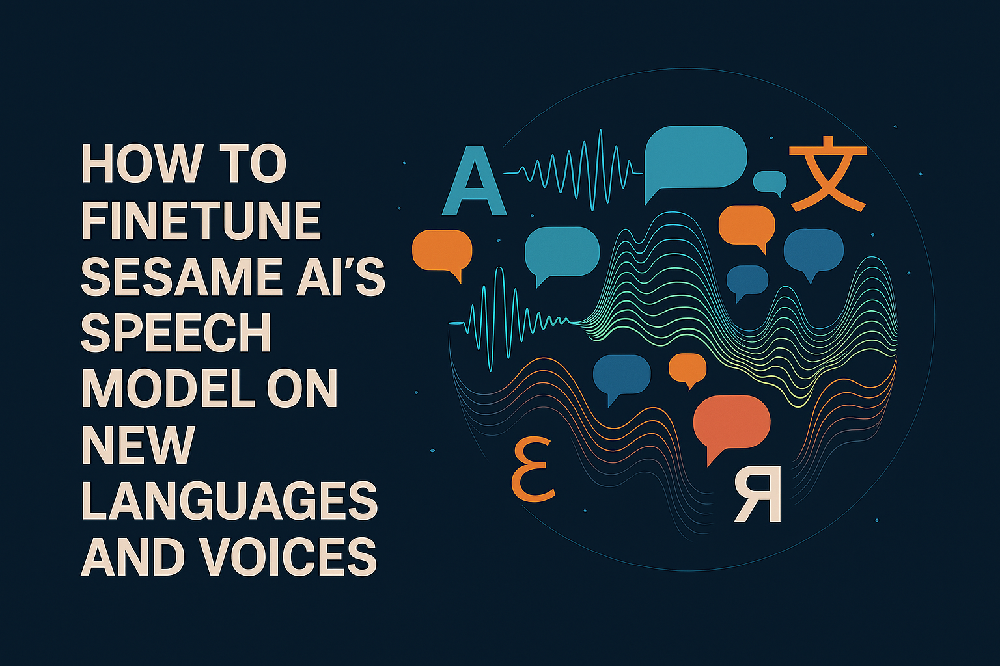
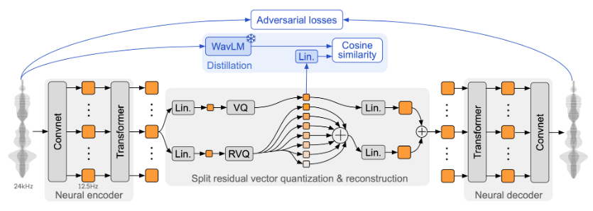
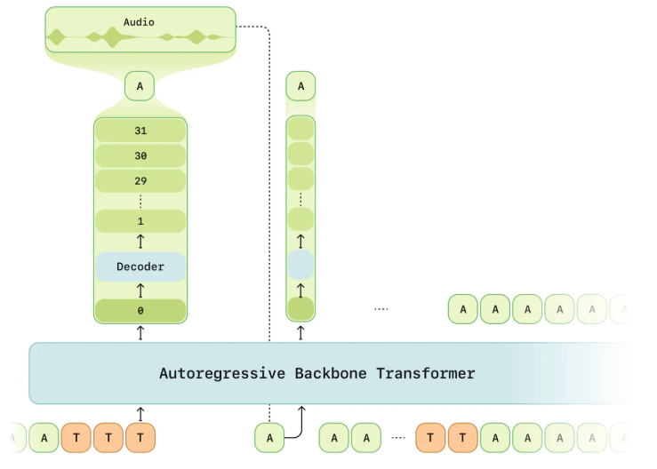
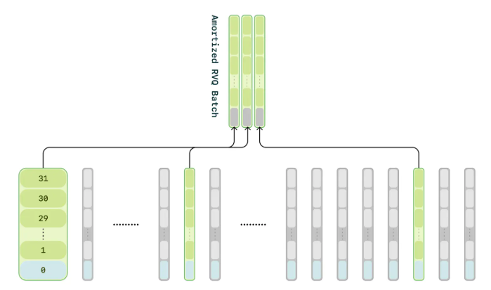
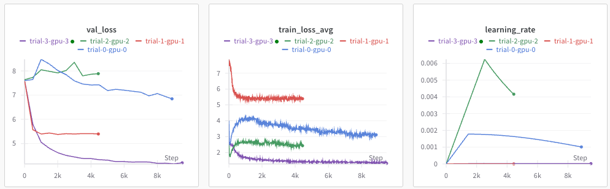
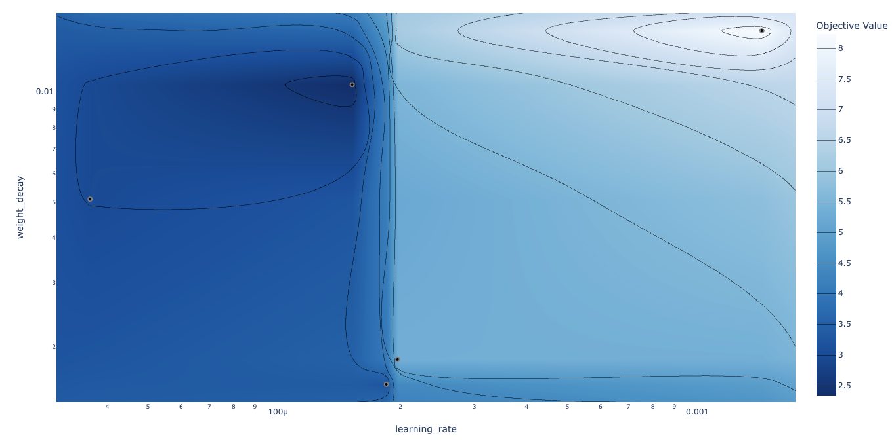
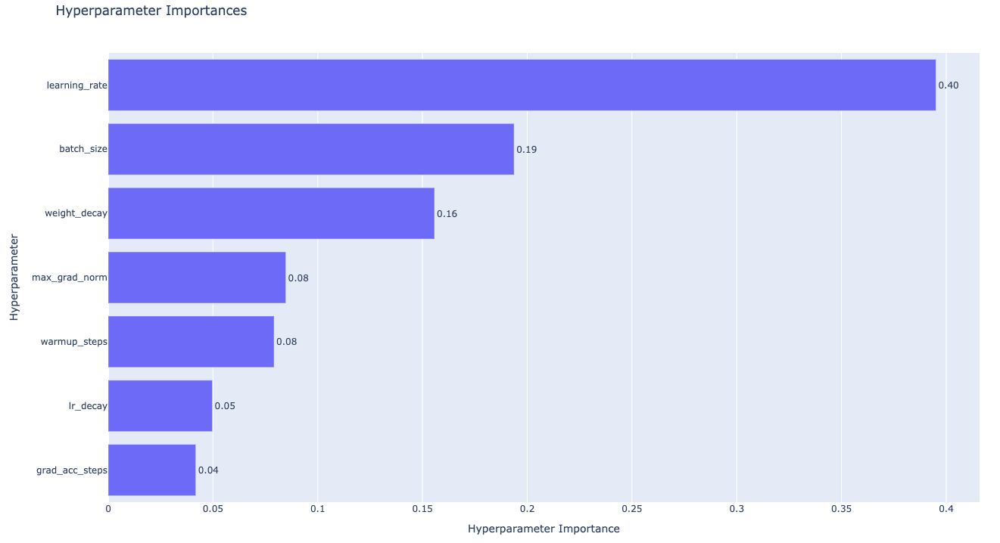

Sesame AI recently stirred up a lot hype with their open source ultra-realistic [conversational speech model (CSM)](https://www.sesame.com/research/crossing_the_uncanny_valley_of_voice#demo), but they did not open source their training code and it only comes in a handful of english voices. This blog will teach you how to finetune it on new languages and voices.

Specifically, you will learn:
- How the model works.
- How to prepare a finetuning dataset.
- How to sweep finetuning hyperparameters (using Optuna).
- How to actually finetune the model.

If you don't care about any of the technical details and want to jump straight into finetuning on your own datasets, please clone the accompanying [GitHub repo](https://github.com/knottwill/sesame-finetune.git) and follow the `README.md`. You will only need the following 3 commands:

```bash
# Pre-tokenize data (for efficient training)
python pretokenize.py --train_data /path/to/train/metadata.json --val_data /path/to/val/metadata.json --output /path/to/tokenized/data.pkl

# (Optional) Hyperparameter sweep
python sweep.py --data /path/to/tokenized/data.pkl --sweep_config ./configs/sweep.yaml --output_dir ./my-sweep --n_epochs 3 --n_trials 50 --n_gpus 2 --wandb_api_key WANDB_API_KEY

# Main: Finetune the model
python finetune.py --data /path/to/tokenized/data.pkl --config ./configs/default.yaml --n_epochs 25 --gen_every 500 --gen_sentence "Marie aime les pommes et les poires." --wandb_api_key WANDB_API_KEY
```

In what follows I will be assuming basic knowledge of deep learning, generative models, and implementation in PyTorch. 

## Contents

1. [Theory](#theory)
2. [Implementation](#implementation)
   - Installation 
   - Dataset Preparation
   - Training Pipeline
   - Hyperparameter Optimization
3. [Closing Thoughts](#closing-thoughts)


## Theory

Before we jump into implementation, I want to quickly summarise the architecture and clarify some technical points that are relevant for finetuning. I also recommend reading the [official blog post](https://www.sesame.com/research/crossing_the_uncanny_valley_of_voice#demo), which gives a great description of the model.

Much like many contemporary generative models of audio, images, and video, Sesame's CSM is an autoregressive transformer that operates in the latent space of a pre-trained autoencoder. In particular, it operates on discrete audio tokens encoded by the [Mimi split-RVQ tokenizer](https://arxiv.org/html/2410.00037v2). There are two main reasons why this typically works better than using "raw" audio. Firstly, only a small fraction of raw audio content is actually perceptable to humans and the rest is noise. Discrete audio tokenizers like Mimi are good at retaining just the perceptable signal, allowing the generative model to focus purely on what "matters". Secondly, autoregressive transformers generally work better on discrete inputs (there is just something special about cross entropy loss). 

Text is tokenized by the [Llama tokenizer](https://huggingface.co/meta-llama/Llama-3.2-1B), and speaker information is incorporated by simply prepending a speaker ID to the text prior to tokenization (e.g. `"[3]I am so hungry right now"` if the corresponding audio is spoken by speaker 3).


**Mimi audio tokenizer**

Feel free to skip this section as we will be using Mimi as-is and don't really need to understand it in depth. To quickly summarise:
- An encoder splits the audio signal into frames, passes each frame through a convolutional neural network and a transformer to produce a continuous latent vector for each frame.
- The latent vector is quantized using split residual vector quantization, which works by quantizing the raw latent vector with a semantic VQ codebook and iteratively quantizing the residual error from each previous quantization step with a multi-level RVQ. The semantic codebook is trained with a cosine similarity loss against WavLM embeddings to capture phonetic information, while the RVQ codebooks capture acoustic details. This split architecture allows better separation of semantic and acoustic information compared to standard RVQ. Read more about RVQ [here](https://www.assemblyai.com/blog/what-is-residual-vector-quantization) and split-RVQ in the [official paper](https://arxiv.org/html/2410.00037v2).
- The decoder passes the RVQ tokens through an inverse quanitzation process, then a transformer and CNN to reconstruct the audio waveform. 

<div style="text-align: center">
  
  <p><em>Schematic of the Mimi split-RVQ tokenizer architecture.</em></p>
</div>

**CSM-1B architecture**

Sesame trained 3 models (CSM-1B, CSM-3B, CSM-8B) then open-sourced only their smallest: CSM-1B. This is likely not the model used for their impressive demos, but it is still a very strong TTS model. 

CSM-1B consists of a 1B transformer backbone and 100M transformer decoder, both of which are variants of the Llama architecture. The input to the backbone is interleaved audio and text tokens. I highly suspect that the motivation for this is that Sesame wanted their model to sound really conversational, so they would have trained on a large amount of conversational data and each training example might look something like:

```python
["[1]Hey, how's it going?", audio_from_speaker_1, "[5]Going well thanks, you?", audio_from_speaker_5]
```

Once we have our interleaved tokens, we use the following procedure to obtain a prediction:
- The backbone operates directly on these tokens, producing an enbedding `h` at each audio token position which is used to predict the next audio frame.
- A single linear map is applied to the embedding `h` to predict the zeroth codebook (the semantic codebook).
- The decoder operates on the backbone embedding `h` and all N codebooks and predicts the N - 1 acoustic codebooks.

<div style="text-align: center">
  
  <p><em>Schematic of Sesame's CSM model showing the backbone and decoder transformer.</em></p>
</div>

**Training**

*Compute amortization*: The audio decoder is processing an effective batch size of `batch_size x sequence_length x num_codebooks`, which is a high memory burden and thus it significantly slows training and limits model scaling. To address this, the decoder is only trained on a random 1/16 subset of the audio frames, but the zeroth codebook is trained on every frame.

<div style="text-align: center">
  
  <p><em>Schematic of compute amortization: only a subset of frames are used to train the decoder.</em></p>
</div>

Sesame did not release all the details of their training procedure, but since we are using discrete tokens it is a safe assumption that the model is trained using cross entropy loss. As mentionned, the backbone alone is enough to predict the zeroth codebook, then the decoder predicts the remaining $N-1$ codebooks. Theoretically, we could detach the decoder's input from the computational graph such that the backbone and decoder are trained separately, but I think it is also a safe assumption that they are trained concurrently. 

## Implementation

Now we have an understanding of the model and training procedure, lets look at how to implement the finetuning pipeline. Most TTS datasets are not conversational, hence to make this tutorial as compatible as possible with *your* data, we will not be interleaving text and audio as described above. However, I would definitely recommend doing this if you have conversational data.

### 1. Installation

Frustratingly, the sesame repo is not set up for installation as a python library (despite their `setup.py` file), thus to use their code we must manually install their repo and add the local version to our `sys.path`:

```bash
git clone https://github.com/SesameAILabs/csm.git ~/csm
cd ~/csm
git checkout 836f886515f0dec02c22ed2316cc78904bdc0f36
export CSM_PATH='~/csm'
```

Then in our code we can use

```python
import sys
sys.path.append(os.getenv("CSM_PATH", "~/csm"))

# now we can import their model and other useful functionality
from models import Model
from generator import Generator
```

### 2. Data Set-up and Pre-tokenization

Unsurprisingly, you will need a dataset to finetune on. Prepare your dataset with train set and validation set metadata files where each entry contains: the path to an audio wav file, the text transcription, start / end times of the transcription in the wav file (optional), and the speaker ID (optional). An example `metadata.json` file might look like:

```json
  {
    "text": "They had obvious value as wonders of the natural world.",
    "path": "/data/utterance_0.wav",
  },
  {
    "text": "At the time, Niagara Falls was a thriving community.",
    "path": "/data/utterance_1.wav",
  },
  {
    "text": "and ten years later the Fort Worth and Rio Grande Railroad laid tracks in the county.",
    "path": "/data/long_audio.wav",
    "start": 171.1,  # Start point (optional)
    "end": 182.6,    # End point (optional)
    "speaker": 30,   # Speaker id (optional)
  },
```

The sesame CSM uses the pre-trained Mimi audio tokenizer and Llama3 text tokenizer as they come. Since we will likely want to do multiple training runs and train for multiple epochs on each run, it is more computationally efficient to tokenize and save out all our data before starting training (then we can reuse them for multiple runs). 

<details>

We can load our tokenizers like so:

```python
from huggingface_hub import hf_hub_download
from moshi.models import loaders

sys.path.append(os.getenv("CSM_PATH", "~/csm"))
from generator import load_llama3_tokenizer

def load_tokenizers(device):
    text_tokenizer = load_llama3_tokenizer()
    mimi_weight = hf_hub_download(loaders.DEFAULT_REPO, loaders.MIMI_NAME)
    mimi = loaders.get_mimi(mimi_weight, device=device)
    mimi.set_num_codebooks(32)
    audio_tokenizer = mimi
    
    return text_tokenizer, audio_tokenizer
```

To tokenize our dataset using a `metadata.json` file, we can use:

```python
import pandas as pd 
from tqdm import tqdm
import torchaudio

def get_tokens(data_path, audio_tokenizer, text_tokenizer, device):
    df = pd.read_json(data_path)
    audio_tokens, text_tokens = [], []
    for _, data_point in tqdm(df.iterrows()):
        if "start" and "end" in data_point:
            sample_rate = torchaudio.info(data_point["path"]).sample_rate
            frame_offset = int(data_point["start"] * sample_rate)
            num_frames = int((data_point["end"] - data_point["start"]) * sample_rate)
        else:
            frame_offset = 0
            num_frames = -1

        # load audio
        audio_tensor, sample_rate = torchaudio.load(
            data_point["path"], frame_offset=frame_offset, num_frames=num_frames
        )
        audio_tensor = torchaudio.functional.resample(audio_tensor.squeeze(0), orig_freq=sample_rate, new_freq=24_000)
        audio_tensor = audio_tensor.unsqueeze(0).unsqueeze(0).to(device)

        # tokenize audio
        audio_tokens.append(audio_tokenizer.encode(audio_tensor)[0].tolist())

        # prepend speaker id and tokenize text
        text = f"[{data_point['speaker'] if 'speaker' in data_point else 999}]" + data_point["text"]
        text_tokens.append(text_tokenizer.encode(text))

    return audio_tokens, text_tokens
```

Finally we pre-tokenize and save the train and validation sets. Tokenized text is represented by a list of token ids, whereas the tokenized representation of an audio sample is an array of shape N x S containing token ids from the Mimi tokenizer codebooks, where N is the number of codebooks and S is the sequence length.

```python
device = torch.device("cuda" if torch.cuda.is_available() else "cpu")

text_tokenizer, audio_tokenizer = load_tokenizers(device)

audio_tokens_train, text_tokens_train = get_tokens("/path/to/train/metadata.json", audio_tokenizer, text_tokenizer, device)
audio_tokens_val, text_tokens_val = get_tokens("/path/to/val/metadata.json", audio_tokenizer, text_tokenizer, device)
all_tokens = {
	"audio_tokens_train": audio_tokens_train, # list[list[list[int]]]
	"text_tokens_train": text_tokens_train,   # list[list[int]]
	"audio_tokens_val": audio_tokens_val,     # list[list[list[int]]]
	"text_tokens_val": text_tokens_val,       # list[list[int]]
}

with open("/path/to/tokenized/data.pkl", "wb") as f:
    pickle.dump(all_tokens, f)
```

</details>

### 3. Dataloaders

Now we have our pre-tokenized data, we will build our dataloaders.

<details><br>

Lets start by creating a simple self-explanatory dataset class:

```python
from typing import List
import numpy as np
import torch

class TokenizedDataset(torch.utils.data.Dataset):
	def __init__(self, audio_tokens: List[List[List[int]]], text_tokens: List[List[int]]):
	self.audio_tokens = audio_tokens
	self.text_tokens = text_tokens

def __len__(self):
	return len(self.audio_tokens)

def __getitem__(self, index: int):
	return {"audio": self.audio_tokens[index], "text": self.text_tokens[index]}
```

Next we will write a collation function for the dataloader. This:
- Accepts a list of dictionaries returned by `TokenizedDataset.__getitem__`
- Appends an EOS frame to the audio tokens
- Appends an extra dimension to the audio tokens to account for text tokens
- Creates a padding mask to indicate that the text dimension is padding for the audio tokens
- Prepends n_codebooks dimensions to the text tokens to account for audio tokens
- Creates a padding mask to indicate that the audio dimensions are padding for the text tokens
- Concatenates the text and audio tokens
- Pads the tokens and padding masks to the maximum sequence length in the batch
- Returns the tokens and padding masks

```python
from typing import List
import torch
from torch.nn.utils.rnn import pad_sequence

def collate_fn(batch: List[dict]):
    tokens, tokens_mask = [], []
    n_codebooks = 32
    for item in batch:
        audio_tokens = torch.tensor(item["audio"]) # [n_codebooks, audio_seq_len]
        text_tokens = torch.tensor(item["text"])   # [text_seq_len]

        # add EOS frame
        eos_frame = torch.zeros(audio_tokens.size(0), 1)
        audio_tokens = torch.cat([audio_tokens, eos_frame], dim=1)  # [n_codebooks, audio_seq_len+1]

        # add extra dimension for text ids
        audio_frame = torch.zeros(audio_tokens.size(1), n_codebooks + 1).long()  # [audio_seq_len+1, n_codebooks+1]
        audio_frame[:, :-1] = audio_tokens.transpose(0, 1)
        audio_frame_mask = torch.zeros(audio_tokens.size(1), n_codebooks + 1).bool()  # [audio_seq_len+1, n_codebooks+1]
        audio_frame_mask[:, :-1] = True

        text_frame = torch.zeros(len(text_tokens), n_codebooks + 1).long()
        text_frame[:, -1] = torch.tensor(text_tokens)
        text_frame_mask = torch.zeros(len(text_tokens), n_codebooks + 1).bool()
        text_frame_mask[:, -1] = True

        tokens.append(torch.cat([text_frame, audio_frame], dim=0))
        tokens_mask.append(torch.cat([text_frame_mask, audio_frame_mask], dim=0))

    tokens = pad_sequence(tokens, batch_first=True)
    tokens_mask = pad_sequence(tokens_mask, batch_first=True, padding_value=False)

    # both: [batch_size, max_seq_len, n_codebooks+1]
    return tokens, tokens_mask
```

We will also make a sampler object that minimizes padding in batches by grouping samples with similar lengths:

```python
class BucketSampler(torch.utils.data.sampler.Sampler):
    def __init__(
        self, lengths: List[int], batch_size: int, shuffle: bool = True, is_infinite: bool = True, random_seed: int = 42
    ):
        self.shuffle = shuffle
        self.batch_size = batch_size
        self.is_infinite = is_infinite
        self.random_seed = random_seed
        self.local_step = 0
        self.bins = self._create_bins(lengths, batch_size)

    def _create_bins(self, lengths: List[int], batch_size: int) -> List[List[int]]:
        indices_with_lengths = [(i, length) for i, length in enumerate(lengths)]
        indices_with_lengths.sort(key=lambda x: x[1])

        # Group into bins
        bins = []
        current_bin = []
        for idx, length in indices_with_lengths:
            if len(current_bin) >= batch_size:
                bins.append(current_bin)
                current_bin = []
            current_bin.append(idx)

        if current_bin:
            bins.append(current_bin)

        return bins

    def _shuffle_bins(self, epoch: int):
        rng = np.random.RandomState(epoch + self.random_seed)
        rng.shuffle(self.bins)  # shuffle bins
        for i in range(len(self.bins)):  # shuffle samples in each bin
            self.bins[i] = [self.bins[i][j] for j in rng.permutation(len(self.bins[i]))]

    def __iter__(self):
        epoch = 0
        while True:
            if self.shuffle:
                self._shuffle_bins(epoch)

            for bin_indices in self.bins:
                self.local_step += 1
                yield bin_indices

            if not self.is_infinite:
                break

            epoch += 1

    def __len__(self):
        return len(self.bins)
```

Finally we can create our dataloaders:

```python
def create_dataloaders(all_tokens: dict, batch_size: int, infinite_train: bool = False):
    trainset = TokenizedDataset(all_tokens["audio_tokens_train"], all_tokens["text_tokens_train"])
    valset = TokenizedDataset(all_tokens["audio_tokens_val"], all_tokens["text_tokens_val"])

    trainsampler = BucketSampler(
        lengths=[len(tokens) for tokens in all_tokens["audio_tokens_train"]],
        batch_size=batch_size,
        is_infinite=infinite_train,
        shuffle=True,
    )

    valsampler = BucketSampler(
        lengths=[len(tokens) for tokens in all_tokens["audio_tokens_val"]],
        batch_size=batch_size,
        is_infinite=False,
        shuffle=False,
    )

    trainloader = torch.utils.data.DataLoader(
        trainset, batch_sampler=trainsampler, num_workers=0, collate_fn=collate_fn, pin_memory=True
    )

    valloader = torch.utils.data.DataLoader(
        valset, batch_sampler=valsampler, num_workers=0, collate_fn=collate_fn, pin_memory=True
    )

    return trainloader, valloader
```

</details>

### 4. Forward pass

Next we need to write the model's forward function, which missing from Sesame's code.

<details>

The forward function:
- embeds the tokens and retains only the non-padding embeddings
- computes the backbone attention mask using the padding mask
- does a forward pass through the backbone transformer and extracts the embeddings used for audio codebook prediction
- computes the first codebook loss
- implements amortization by training the decoder on a random 1/16 subset of audio tokens
- computes the decoder loss
- returns the total loss as a weighted sum of the backbone-only and decoder+backbone losses

```python
def forward(self, tokens: torch.Tensor, tokens_mask: torch.Tensor):
    """
    tokens: (batch_size, seq_len, n_codebooks+1)
    tokens_mask: (batch_size, seq_len, n_codebooks+1)
    """
    dtype = next(self.parameters()).dtype
    bsz, seq_len, _ = tokens.size()
    device = tokens.device

    # embed tokens
    embeds = self._embed_tokens(tokens)

    # get targets and codebook embeddings corresponding to audio tokens
    audio_mask = tokens_mask[:, :, 0]  # [bsz, seq_len]
    target_tokens = tokens[audio_mask][:, :-1]  # [audio_len, n_codebooks]
    c_embeds = embeds[:, :, :-1, :][audio_mask]  # [audio_len, n_codebooks, embed_dim] 

    # retain just non-padding embeddings
    masked_embeds = embeds * tokens_mask.unsqueeze(-1)
    h = masked_embeds.sum(dim=2)

    # backbone forward pass
    padding_mask = tokens_mask[:, :, 0] | tokens_mask[:, :, -1]  # [bsz, seq_len]
    backbone_attn_mask = _create_causal_mask(seq_len, device)  # [seq_len, seq_len]
    padding_3d = padding_mask.unsqueeze(-1) * padding_mask.unsqueeze(1)  # [bsz, seq_len, seq_len]
    backbone_attn_mask = backbone_attn_mask.unsqueeze(0) * padding_3d
    backbone_attn_mask = backbone_attn_mask | torch.eye(seq_len, device=device).bool().unsqueeze(0).expand(bsz, -1, -1)
    input_pos = torch.arange(0, seq_len).unsqueeze(0).expand(bsz, seq_len).long().to(device)
    h = self.backbone(h, input_pos=input_pos, mask=backbone_attn_mask).to(dtype=dtype)

    # get backbone embeddings used for audio codebook prediction
    audio_mask = torch.roll(audio_mask, -1, 1)  # shift audio mask to the right by 1
    audio_h = h[audio_mask]  # [audio_len, embed_dim]

    # predict first codebook and compute loss
    c0_logits = self.codebook0_head(audio_h)  # [audio_len, audio_vocab_size]
    c0_target = target_tokens[:, 0]  # [audio_len]
    c0_loss = F.cross_entropy(c0_logits, c0_target)

    # "compute amortization" (train decoder on random 1/16 subset of audio tokens)
    indices = torch.randperm(c_embeds.size(0))[: c_embeds.size(0) // 16]
    c_embeds = c_embeds[indices][:, :-1, :]  # [audio_len//16, n_codebooks-1, embed_dim]
    audio_h = audio_h[indices]  # [audio_len//16, embed_dim]
    target_tokens = target_tokens[indices][:, 1:]  # [audio_len//16, n_codebooks-1]

    # concatenate backbone embeddings and codebook embeddings for decoder input
    decoder_embeds = torch.cat(
        [audio_h.unsqueeze(1), c_embeds], dim=1
    )  # [audio_len//16, n_codebooks, embed_dim]
    N, n_codebooks, _ = decoder_embeds.size()
    c_pos = torch.arange(0, n_codebooks).unsqueeze(0).expand(N, n_codebooks).long().to(device)

    decoder_causal_mask = _create_causal_mask(decoder_embeds.size(1), device).expand(N, -1, -1)
    decoder_h = self.decoder(self.projection(decoder_embeds), input_pos=c_pos, mask=decoder_causal_mask).to(dtype=dtype)
    c_logits = torch.einsum("bsd,sdv->bsv", decoder_h[:, 1:, :], self.audio_head)

    c_loss = F.cross_entropy(c_logits.reshape(-1, c_logits.size(-1)), target_tokens.reshape(-1))

    loss = (1 - self.decoder_loss_weight) * c0_loss + self.decoder_loss_weight * c_loss
    return loss
```

We can add this custom forward function with:

```python
import types

sys.path.append(os.getenv("CSM_PATH", "~/csm"))
from models import Model

def load_model(pretrained_model_name_or_path, device, decoder_loss_weight):
    model = Model.from_pretrained(pretrained_model_name_or_path)
    model.decoder_loss_weight = decoder_loss_weight
    model.forward = types.MethodType(forward, model)  # add the forward method to the model
    model = model.to(device=device, dtype=torch.bfloat16)
    return model
```

</details>

### 5. Training 

We now have all the elements to write our training pipeline. Below is an extremely simple training pipeline for illustration purposes only. I **highly** recommend referring to the [GitHub repo](https://github.com/knottwill/sesame-finetune.git), which implements various useful techniques such as gradient clipping, gradient accumulation, mixed precision training, better learning rate scheduling, experiment tracking with Wandb, logging of validation and generations etc.

```python
import os
import pickle
from pathlib import Path
import torch
from torch.optim import AdamW
from torch.optim.lr_scheduler import LinearLR
from tqdm import tqdm

sys.path.append(os.getenv("CSM_PATH", "~/csm"))
from models import Model

n_epochs = 50
output_dir = Path("./exp") 
output_dir.mkdir(parents=True, exist_ok=True)

device = torch.device("cuda" if torch.cuda.is_available() else "cpu")

# Define finetuning config
config = {
    "batch_size": 8,
    "learning_rate": 3e-5,
    "weight_decay": 0.002,
    "decoder_loss_weight": 0.5,
}

# Load tokenized data
with open("/path/to/tokenized/data.pkl", "rb") as f:
    all_tokens = pickle.load(f)

# Set-up (model, dataloaders, optimizer, LR scheduler)
model = load_model("sesame/csm-1b", device, config["decoder_loss_weight"])
trainloader, valloader = create_dataloaders(all_tokens, config["batch_size"])
optimizer = AdamW(model.parameters(), lr=config["learning_rate"], weight_decay=config["weight_decay"])
scheduler = LinearLR(optimizer, total_iters=n_epochs * len(trainloader))

# Simple training loop
model.train()
for epoch in range(n_epochs):
    for tokens, tokens_mask in tqdm(trainloader, desc=f"Epoch {epoch}"):
        tokens = tokens.to(device)
        tokens_mask = tokens_mask.to(device)
        
        loss = model(tokens, tokens_mask)
        loss.backward()
        
        optimizer.step()
        optimizer.zero_grad()
        scheduler.step()
```


### (Optional) Hyperparameter Optimization

Successful finetuning of the CSM is fairly sensitive to the choice of hyperparameters, hence it is wise to sweep hyperparameters before the main finetuning run. I recommend using [this script](https://github.com/knottwill/sesame-finetune/blob/main/sweep.py) to perform the sweep, which offers:
- Parallelism of trials across multiple devices or within a single device.
- Logging of trials to Weights & Biases for comparison. For example: 

    
- Various visualizations of results:
    - Contours: 
    
        

    - Parameter importances:

        

We use the [Optuna](https://optuna.org/) package for sweeping hyperparameters, which offers two particularly useful features:
- Efficient searching of hyperparameter space using the Tree-structured Parzen Estimator algorithm. 
- Pruning of unpromising trials early in training based on some stopping rule. Below our stopping rule is that a trial is pruned if the intermediate validation loss is worse than the median of previous trials at the same step. 

For illustration purposes only, below is a simplified version of the sweep script:

```python
import os
import pickle
from pathlib import Path
import yaml
import optuna
import torch
from torch.optim import AdamW
from torch.optim.lr_scheduler import LinearLR
from tqdm import tqdm
import types

sys.path.append(os.getenv("CSM_PATH", "~/csm"))
from models import Model


def objective(trial, device, all_tokens, n_epochs):

    config = {
        "batch_size": trial.suggest_categorical("batch_size", [8, 16, 32]),
        "learning_rate": trial.suggest_float("learning_rate", 1e-6, 1e-2, log=True),
        "weight_decay": trial.suggest_float("weight_decay", 1e-3, 1e-1, log=True),
        "decoder_loss_weight": 0.5,
    }

    # Set-up (model, dataloaders, optimizer, LR scheduler)
    model = load_model("sesame/csm-1b", device, config["decoder_loss_weight"])
    trainloader, valloader = create_dataloaders(all_tokens, config["batch_size"])
    optimizer = AdamW(model.parameters(), lr=config["learning_rate"], weight_decay=config["weight_decay"])
    scheduler = LinearLR(optimizer, total_iters=n_epochs * len(trainloader))
    
    # Training loop
    model.train()
    best_val_loss = float('inf')
    
    for epoch in range(n_epochs):
        for tokens, tokens_mask in tqdm(trainloader, desc=f"Epoch {epoch}"):
            tokens, tokens_mask = tokens.to(device), tokens_mask.to(device)
            
            loss = model(tokens, tokens_mask)
            loss.backward()
            
            optimizer.step()
            optimizer.zero_grad()
            scheduler.step()
        
        # Validation
        model.eval()
        val_losses = []
        with torch.no_grad():
            for tokens, tokens_mask in valloader:
                tokens = tokens.to(device)
                tokens_mask = tokens_mask.to(device)
                loss = model(tokens, tokens_mask)
                val_losses.append(loss.item())
        
        val_loss = sum(val_losses) / len(val_losses)
        if val_loss < best_val_loss:
            best_val_loss = val_loss
        
        # Report to Optuna for pruning
        trial.report(val_loss, epoch)
        if trial.should_prune():
            raise optuna.exceptions.TrialPruned()
        
        model.train()
    
    return best_val_loss

with open("/path/to/tokenized/data.pkl", "rb") as f:
    all_tokens = pickle.load(f)

device = torch.device("cuda" if torch.cuda.is_available() else "cpu")

# Create study and run optimization
study = optuna.create_study(
    study_name="csm-sweep",
    direction="minimize",
    pruner=optuna.pruners.MedianPruner()
)

n_epochs = 3
study.optimize(
    lambda trial: objective(trial, device, all_tokens, n_epochs),
    n_trials=50
)

# Save best configuration
OUTPUT_DIR = Path("./sweep")
OUTPUT_DIR.mkdir(parents=True, exist_ok=True)
with open(OUTPUT_DIR / "best_config.yaml", "w") as f:
    yaml.safe_dump(study.best_trial.params, f, default_flow_style=False)

```

## Closing thoughts

In this blog post, we explored:

- The model architecture, including the Mimi tokenizer and how it trains efficiently.
- How to prepare and pre-tokenize a dataset for finetuning.
- Implementation of efficient training with bucketed sampling and compute amortization.
- Hyperparameter optimization using Optuna.

Feel free to open issues on the GitHub repo if you run into any problems. Happy finetuning!
